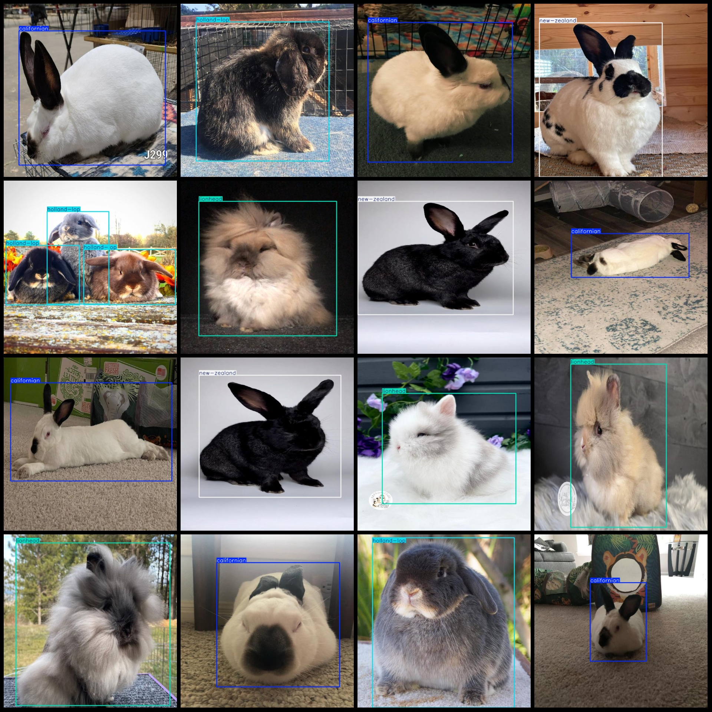
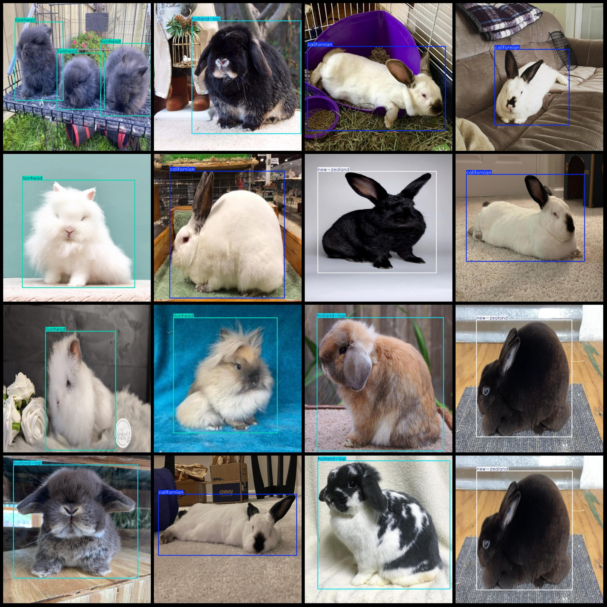

# Rabbit Breeds Dataset: VOC+YOLO Format, 3100 Images with 4 Classes

Dataset format: Pascal VOC format + YOLO format (txt file without split path, only containing jpg images and corresponding VOC format xml files and yolo format txt files)
Number of images (jpg file counts): 3100
Number of annotations (xml file counts): 3100
Number of annotations (txt file counts): 3100
Number of annotation categories: 4
Annotation category names (note that the order of labels in the yolo format does not match this, but is based on the classes.txt file in the labels folder): ["californian", "holland-lop", "lionhead", 
"new-zealand"]
Number of boxes for each category:
- California rabbits (californian) boxes = 862
- Dutch Lop (holland-lop) boxes = 808
- Lion Head (lionhead) boxes = 867
- New Zealand rabbits (new-zealand) boxes = 777
Total boxes: 3314
Number of images per category:
- California rabbits (californian) images = 775
- Dutch Lop (holland-lop) images = 775
- Lion Head (lionhead) images = 775
- New Zealand rabbits (new-zealand) images = 775
Image resolution: 640x640
Annotation tool used: labelImg
Annotation rules: Mark a box around the class
Important note: The dataset does not have a training/validation/test split; you will need to do that yourself.
Special declaration: This dataset does not guarantee any accuracy for models trained on it or their weights.
Image preview:

## Images

Here is a pay link on Stripe ( https://buy.stripe.com/3cs8yP7sY87d0vu9AB ). Please contact me lonlonago@foxmail.com after funding $89, and I will send you a complete data files , thank you!

